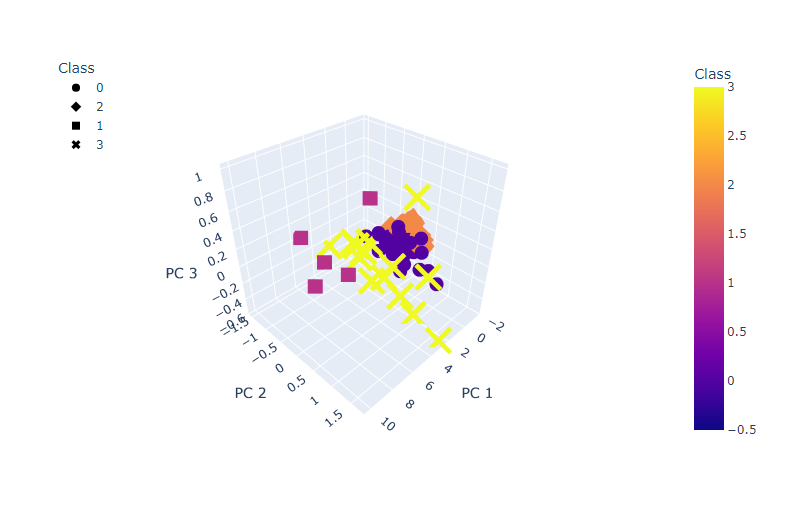

# Rural Surge: A Study of Internet Quality & Availability in Kansas

<<<<<<< HEAD
### Project Team
Sebastian Scholl, Fernando Porras, Mindy Collmeyer, Teresa Wehmeier


### Background on our Topic
=======
## Project Team
Sebastian Scholl, Fernando Porras, Mindy Collmeyer, Teresa Wehmeier
  

## Background on our Topic
>>>>>>> 612ea0ab911bba99f245506d149fb30104126976
For small rural counties in Kansas, the 2020 pandemic emphasized a lack of quality internet access. Schools were closed, and emergency remote instruction became the method to address educational delivery moving into fall 2020. However, as students and parents attempted to learn and work from home, it became clear that not all internet is created equal. Many community members had only cellular data service, which made participating in an online learning environment impossible. Those who had internet access experienced low download rates that many were unable to participate in online class activities.

Our group decided to dive into this topic, and research internet availability and quality in the state of Kansas.
  

<<<<<<< HEAD
### Source of our Data
- State Library of Kansas (https://kslib.info/423/State-Data-Center)
- FCC Fixed Broadband Deployment (https://opendata.fcc.gov/Wireline/Fixed-Broadband-Deployment-Data-December-2020/hicn-aujz)


### Questions we hope to answer with the data
- How does internet access support (quality, availability, etc) compare between rural and urban areas in Kansas?
- What Internet Service Providers (ISPs) are available in Kansas? How does their support vary between rural and urban communities?


### Communication Protocols
=======
## Communication Protocols
>>>>>>> 612ea0ab911bba99f245506d149fb30104126976
- Group Slack channel
- Group Project GitHub, including a branch for each team member
- Breakout room during class time
- Team Zoom calls (March 19th and 26th, April 1st, 2nd, 3rd)
- Team has shared phone numbers and email addresses


<<<<<<< HEAD
### Tools Used on our Project
- GitHub 
    * The largest and most advanced development platform in the world.
    * https://github.com/
    * Used to organize our research and documentation.
- Pandas
    * A fast, powerful, flexible and easy to use open source data analysis and manipulation tool, built on top of the Python programming language
    * https://pandas.pydata.org/
- Python
    * A general-purpose, versatile, and powerful programming language.
    * https://www.python.org/
- QuickDBD
    * A simple online tool to quickly draw database diagrams.
    * https://www.quickdatabasediagrams.com/
    * Used to create our schema doc.
- Canva
    * Online design and publishing tool 
    * https://www.canva.com/
    * Used to design the Project Flowchart.
- GeoJSON
    * A format for encoding a variety of geographic data structures.
    * https://geojson.org/
- Tableau
    * A visual analytics platform transforming the way we use data to solve problems—empowering people and organizations to make the most of their data.
    * https://www.tableau.com/

### Machine Learning Model
- <a href="Resources/Machine Learning Work Flowchart.pdf">Project Planning diagram</a> - Outlines our plan for collecting data, and presenting it to the class.
- <a href="Resources/ProjectFlowchart.pdf"> Project Flowchart</a> - Decision Tree model for our project.


### Database
- See <a href="Resources/schema.sql">schema doc</a>


### ERD FCC Tables


=======
## Tools Used on our Project
- [GitHub](https://github.com/)
    * The largest and most advanced development platform in the world.
    * Used to organize our research and documentation.
- [Pandas](https://pandas.pydata.org/)
    * A fast, powerful, flexible and easy to use open source data analysis and manipulation tool, built on top of the Python programming language
- [Python](https://www.python.org/)
    * A general-purpose, versatile, and powerful programming language.
- [QuickDBD](https://www.quickdatabasediagrams.com/)
    * A simple online tool to quickly draw database diagrams.
    * Used to create ERDs.
- [Visual Studio Code](https://code.visualstudio.com/)
   * A code editor redefined and optimized for building and debugging modern web and cloud applications
- [Canva](https://www.canva.com/)
    * Online design and publishing tool.
    * Used to design the Project Flowchart.
- [Amazon S3](https://aws.amazon.com/s3/)
    * Object storage service offering industry-leading scalability, data availability, security, and performance.
    * Used to store our data on the cloud
- [pgAdmin](https://www.pgadmin.org/)
    * The most popular and feature rich Open Source administration and development platform for PostgreSQL, the most advanced Open Source database in the world.
- [PySpark](https://spark.apache.org/docs/latest/api/python/)
    * PySpark is the Python API for Apache Spark, an open source, distributed computing framework and set of libraries for real-time, large-scale data processing.
- [GeoJSON](https://geojson.org/)
    * A format for encoding a variety of geographic data structures.
- [Google Slides](https://www.google.com/slides/about/)
    * Used to present our project plan.
- [Tableau](https://www.tableau.com/)
    * A visual analytics platform transforming the way we use data to solve problems—empowering people and organizations to make the most of their data.
- [Microsoft Word](https://www.microsoft.com/en-us/microsoft-365/word)
    * Used to create our project plan


## Project Outline

### Our Topic

**Internet Availability & Quality in Kansas**
   - How does internet access support (quality, availability, etc.) compare between rural and urban areas in Kansas?
   - What Internet Service Providers (ISPs) are available in Kansas? 
   - How does their support vary between rural and urban communities?
   - Is there a link between poverty rate and quality internet access?
   - Is there a link between school district success and quality internet access?


### Our Project Plan


   
### Our Research

**Where is our data coming from?**
   - [State Library of Kansas](https://kslib.info/423/State-Data-Center)
     * The Kansas State Library has extensive data for all counties in the state.
     * We plan to use this data as a layer in the interactive map and as a feature in the machine learning model.
     * Kansas info: County data, Lat/long, County population, Poverty by county, School district info
     
   - [FCC Fixed Broadband Deployment](https://broadbandmap.fcc.gov/#/data-download)
     * The FCC tracks broadband access across the United States, which includes an interactive map and the data tables behind the map. 
     * We used an Area table and Provider table to collect data about Internet Providers and speeds correlated with location

   - [United States Department of Agriculture (USDA)](https://www.usda.gov/reconnect)
     * The USDA provides grants and loans to improve internet infrastructure across the nation. 
     * Through this website, we found useful links to datasets from the US Census Bureau.
    
   - [US Census Bureau](https://www.census.gov/programs-surveys/geography/guidance/geo-areas/urban-rural/2010-urban-rural.html)
     * We struggled to find data relevant to our project until we stumbled onto a link to the data from the [USDA ReConnect site](https://www.usda.gov/reconnect).
     * This data was used to obtain the rural and urban density and population percentages by county. 
     * This data is used in the machine learning model, and will be a layer in the interactive map.
   

### Machine Learning Modeling

#### Description of preliminary data preprocessing & database development

  -  Store csv files on GitHub
  -  Create a [Schema](https://github.com/Sebjet24/Rural_Surge/blob/Mindy/Resources/schema.sql) to show how we organized the data
  -  Create an [ERD (Entity Relationship Diagrams)](https://github.com/Sebjet24/Rural_Surge/blob/main/Images/ERD_FCC_tables.png)
   
  - Load data into Amazon S3 bucket

    

  - Connect data from AWS into pgAdmin to create our database

    
    

  - Transform data using PySpark
    * Here is an example: https://github.com/Sebjet24/Rural_Surge/blob/main/my_project_20_group_3.ipynb
    
  - Run various queries and create tables to organize the data we need to run the Machine Learning Model
    * [See our work here!](https://github.com/Sebjet24/Rural_Surge/blob/main/Resources/queries)


#### Description of preliminary feature engineering and preliminary feature selection, including our decision-making process

  - Our initial plan was to include the following as our features:
    * Rural and urban % per KS county
    * Number of ISP options per KS county
    * Highest internet speed per KS county
  
  - The FCC data proved to need a lot of work for us to use it for our machine learning model.
  
  - We used the following as our features:
    * Kansas counties
    * Average of number of ISP options per rural portion of each KS county
    
  - We will also run another model for urban areas as a comparison

  
#### Description of how data was split into training and testing sets

 - Because we used an Unsupervised Machine Learning model, we didn't have training and testing sets.
 - First we used StandardScaler to standardize the data.
 - Then we used PCA (Princial Component Analysis) to reduce dimension to three principal components.
    * PCA is a statistical technique used to speed up machine learning algorithms when the number of input features is high.
    * It transforms a large set of variables into a smaller one that contains most of the info in the original large set.
 - We created a dataframe with the three principal components, generated by PCA
 - We created an elbow curve to determine the best number of clusters to use on our scatter plots.
 - We created a new DataFrame including predicted clusters and population by ISP features.
 - We created a hvplot.scatter plot using x="zero ISP providers" and y="3 or more ISP providers".

#### Explanation of model choice, including limitations and benefits
The team has struggled to decide what questions we want to learn from the machine learning model, mostly because some of the data we are using has limitations. After thoroughly exploring the data, we decided that we had enough data to answer the question: "Does geographic location have an impact on availablity of broadband internet access?" Once we understood our question, we decided, based on the type of data we could extract for the model, that an unsupervised clustering model would fit our data best, because:
1. The data is numeric
2. There are no known outcomes
3. Clusters suit the data we are looking at because our data is "clustered" into Kansas counties and within these counties there are clusteres of rural and urban areas.

After running initial data through the ML model, we were able to produce some scatter plots we felt were useful in "seeing" the clusters; we will continue to add features such as speed, and area type (rural/ urban) to the data set to improve the analysis.

Our process for developing the machine learning model was:
  
- The team discussed the different machine learning options, and initially thought that a **Decision Tree** would be a good fit for our project.
      
     
     
- After learning more about the data, we decided that an **Unsupervised Learning** model would be a better fit. 

  * Here is our model!    [Rural Surge Machine Learning Model](https://github.com/Sebjet24/Rural_Surge/blob/main/RuralSurge_ml_rural.ipynb)
  
  * **2D Scatter Plot**
  
   
  
  * **3D Scatter Plot**
   

#### Limitations and Benefits
The team feels the biggest limitation in developing a machine learning model for this project has been the data itself. It has taken much longer than anticipated to build the data because we have spent so much time manipulating it while trying not to affect the integrity of the data. However, the benefits of the cluster model are that, from a geographical perspective, clustering makes sense, and provides a more visual look at the data.

### Database Integration
The team members are expected to present a fully integrated database, including the following:

* Database stores static data for use during the project
** The data is stored in PostgreSQL and is connected to AWS RDS. Initial data tables included 10, with additions added as we developed data for the machine learing model. The process began with an ERD that has been revised, and a full schema that was used to build the initial data tables.

#### ERD


#### Schema Sample
See full schema <a href="Resources/schema.sql">here</a> and code snip below.

```
-- Create tables for Rural Surge Project

-- Create Validation Table for Area Table tech column from FCC site
SELECT * FROM tech_type;
--
CREATE TABLE tech_type (
	tech_type_code VARCHAR(1) NOT NULL,
    tech_type_desc VARCHAR(20) NOT NULL,
	PRIMARY KEY (tech_type_code)
);

```

* Database interfaces with the project in some format (e.g., scraping updates the database)

Using Google Colab, we updated a table in the PostgreSQL database to add a new column.

```
area_df = spark.read.jdbc(url = "jdbc:postgresql://ruralsurge.cu3ibjje45e1.us-east-1.rds.amazonaws.com:5432/rural_surge_db", 
                     table = "(SELECT * FROM area_table) AS my_table",
                     properties={"user": "root", "password": "XXXXXXX", "driver":  "org.postgresql.Driver"})#.createTempView("tbl")

spark.sql('select * from tbl').show() #or use .collect() to get Rows

import pyspark.sql.functions as F 
length_df = area_df.withColumn("tech_options", F.length("tech"))
length_df.show(truncate=False)

# Configure settings for RDS
mode = "append"
jdbc_url="jdbc:postgresql://ruralsurge.cu3ibjje45e1.us-east-1.rds.amazonaws.com:5432/rural_surge_db"
config = {"user":"root", 
          "password": "#######", 
          "driver":"org.postgresql.Driver"}
    alter table "pct_urban_rural_county" add column "state_county_code" INT;
    update "pct_urban_rural_county"
        set "state_county_code" = concat(state_code,county_code);
```

* Includes at least two tables (or collections, if using MongoDB)
Ten tables were initially created (see schema) and additional tables added as we explored for machine learning data. 

  

* Includes at least one join using the database language (not including any joins in Pandas)

We created a query and subsequent data table with the below, which includes a left outer join from area_table and geo_lookup tables.

    ```
    -- has_0 = Population with zero providers (i.e., no broadband) given choice of technology and speed
    SELECT DISTINCT at.id, at.type, at.urban_rural, at.speed, at.has_0, at.has_1, at.has_2, at.has_3more
    FROM area_table at LEFT OUTER JOIN geo_lookup gl ON (at.id, at.type) = (gl.geoid, gl.type)
    WHERE at.id like '20%'
    AND at.type = 'county';

    ```

* Includes at least one connection string (using SQLAlchemy or PyMongo)
We needed to convert a string of text in a column to a count of the string characters in that column. Fernando was able to pull the data table into Google Colab and Spark to create the new column, then reload it to the shared database through AWS RDS services.

```
area_df = spark.read.jdbc(url = "jdbc:postgresql://ruralsurge.cu3ibjje45e1.us-east-1.rds.amazonaws.com:5432/rural_surge_db", 
                     table = "(SELECT * FROM area_table) AS my_table",
                     properties={"user": "root", "password": "XXXXXXX", "driver":  "org.postgresql.Driver"})#.createTempView("tbl")

spark.sql('select * from tbl').show() #or use .collect() to get Rows

import pyspark.sql.functions as F 
length_df = area_df.withColumn("tech_options", F.length("tech"))
length_df.show(truncate=False)

# Configure settings for RDS
mode = "append"
jdbc_url="jdbc:postgresql://ruralsurge.cu3ibjje45e1.us-east-1.rds.amazonaws.com:5432/rural_surge_db"
config = {"user":"root", 
          "password": "#######", 
          "driver":"org.postgresql.Driver"}
          
# Write review_id_df to table in RDS
length_df.write.jdbc(url=jdbc_url, table='area_mod', mode=mode, properties=config)

```
  
### Visualize the Data
   - [Google Slides](https://github.com/Sebjet24/Rural_Surge/blob/main/Resources/Rural%20Surge.pptx)
   - Tableau
      * [Storyboard](https://github.com/Sebjet24/Rural_Surge/blob/main/Resources/Story%20board.pptx)
>>>>>>> 612ea0ab911bba99f245506d149fb30104126976
