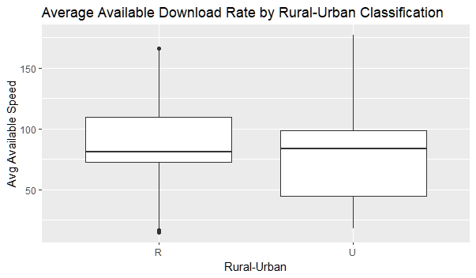

# Rural Surge: A Study of Internet Quality & Availability in Kansas

## Project Team
Sebastian Scholl, Fernando Porras, Mindy Collmeyer, Teresa Wehmeier
  

## Background on our Topic
For small rural counties in Kansas, the 2020 pandemic emphasized a lack of quality internet access. Schools were closed, and emergency remote instruction became the method to address educational delivery moving into fall 2020. However, as students, parents and teachers attempted to learn and work from home, it became clear that not all internet is created equal. Many community members had only cellular data service with only a hotspot connected to a notebook or just a cell phone, which made participating in an online learning environment impossible. Those who had internet access experienced slow download rates that made it difficult to participate in online class activities.

Our group decided to dive into this topic, and research internet availability and quality in the state of Kansas.


## Tools Used on our Project
- [GitHub](https://github.com/)
    * The largest and most advanced development platform in the world.
    * Used to organize our research and documentation.
- [Python](https://www.python.org/)
    * A general-purpose, versatile, and powerful programming language.
- [Jupyter Notebook](https://jupyter.org/)
    * An open source web application, used to create and share documents that contain live code, equations, visualizations, and text.
    * We created our unsupervised machine learning model and random forest model in Jupyter Notebook.
- Libraries we used:
    * [Pandas](https://pandas.pydata.org/)
    * [Plotly](https://plotly.com/)
    * [Scikit-learn](https://scikit-learn.org/stable/)
    * [PySpark](https://spark.apache.org/docs/latest/api/python/)
    * [Numpy](https://numpy.org/)
- [QuickDBD](https://www.quickdatabasediagrams.com/)
    * A simple online tool to quickly draw database diagrams.
    * Used to create ERDs.
- [Canva](https://www.canva.com/)
    * Online design and publishing tool.
    * Used to design the Project Flowchart.
- [Amazon AWS](https://aws.amazon.com/)
    * Amazon Web Services, Inc. (AWS) is a subsidiary of Amazon providing on-demand cloud computing platforms and APIs to individuals, companies, and governments, 
    	on a metered pay-as-you-go basis.
    * We used S3 to store our tables so the whole team could access them quickly and easily online, and RDS to link the tables to pgAdmin.
- [pgAdmin](https://www.pgadmin.org/)
    * The most popular and feature rich Open Source administration and development platform for PostgreSQL, the most advanced Open Source database in the world.
    * Used to create our database (using Postgres)
- [PostgreSQL](https://www.postgresql.org/)
    * Also known as Postgres, PostgreSQL is a free and open-source relational database management system (RDBMS) emphasizing extensibility and SQL compliance.
* [R](https://www.r-project.org/)
    * A programming language for statistical computing and graphics.
    * We used R to create a box-and-whisker plot to present our data in another form.
- [Google Slides](https://www.google.com/slides/about/)
    * Used to present our project plan.
- [Tableau](https://www.tableau.com/)
    * A visual analytics platform transforming the way we use data to solve problems—empowering people and organizations to make the most of their data.
- [Microsoft Word](https://www.microsoft.com/en-us/microsoft-365/word)
    * Used to create our project plan


## Project Outline

### Our Topic

**Internet Availability & Quality in Kansas**
   - How does internet access support (quality, availability, etc.) compare between rural and urban areas in Kansas?
   - What Internet Service Providers (ISPs) are available in Kansas? 
   - How does their support vary between rural and urban communities?


### Our Project Plan


   
### Our Research

**Where is our data coming from?**
   - [State Library of Kansas](https://kslib.info/423/State-Data-Center)
     * The Kansas State Library has extensive data for all counties in the state.
     * We plan to use this data as a layer in the interactive map and as a feature in the machine learning model.
     * Kansas info: County data, Lat/long, County population, Poverty by county, School district info
     
   - [FCC Fixed Broadband Deployment](https://broadbandmap.fcc.gov/#/data-download)
     * The FCC tracks broadband access across the United States, which includes an interactive map and the data tables behind the map. 
     * We used an Area table and Provider table to collect data about Internet Providers and speeds correlated with location

   - [United States Department of Agriculture (USDA)](https://www.usda.gov/reconnect)
     * The USDA provides grants and loans to improve internet infrastructure across the nation. 
     * Through this website, we found useful links to datasets from the US Census Bureau.
     * The website provides information about Federal grant loan eligibility definitions <a href="https://www.usda.gov/reconnect/service-area-eligibility-requirements">here</a>.
    
   - [US Census Bureau](https://www.census.gov/programs-surveys/geography/guidance/geo-areas/urban-rural/2010-urban-rural.html)
     * We struggled to find data relevant to our project until we stumbled onto a link to the data from the [USDA ReConnect site](https://www.usda.gov/reconnect).
     * This data was used to obtain the rural and urban density and population percentages by county. 
     * This data is used in the machine learning model, and will be a layer in the interactive map.
   

### Machine Learning Modeling

The machine learning model code used in the analysis is a **Random Forest** model. The code is available <a href="Analysis/RuralSurge_ml_RandomForrest_AdaBooster.ipynb">here</a>.

**Description of data preprocessing**

* Read in the data file
* Created features in a new dataframe
* Created our targeted dependent variable based on the Urban-Rural Classification
* Described the dataframe to show the total features and rows

Below is an image of some of the preprocessing steps:


The team wanted to answer two questions: 
1) Does geographic location impact internet quality?
2) Does Rural-Urban classifier impact Internet Service Provider (ISP) availabilty?

Due to the need for classification, we changed our mind late in the project to focus on a Random Forest model, which improved predictability of the data to 86% accuracy score once we included average internet speeds. Adding the speed feature was something we knew we had to have to answer our question; however, the data we had to identify these speeds was difficult to work with. We finally came up with a dataset we felt would represent the data well, without impacting the integrity of the analysis.

The features included the average population in each county who had 1) no ISPs (Internet Service Providers) available, 2) one ISP available, 3) two ISP available and 4) three or more ISPs available. We also included the percentage of each of those populations, and a feature for each of the 105 counties in Kansas based on their Rural-Urban classification. Late in the process, we added average available speeds by county and rural-urban classfication. See cell six in the image above for the dependent variable (y-value) described dataframe.

The team feels the biggest limitation in developing a machine learning model for this project has been the data itself. It took much longer than anticipated to build the data because we spent so much time manipulating it while trying not to impact its integrity. In a real world scenario, this may not have been a problem, but due to time constraints for the project, it was an issue. The benefit of the Random Forest model is the ability to use the Urban-Rural classification as our dependent variable, which helps answer the question of whether geographic location has an impact on internet quality and availability.

The team acknowledges a need for additional features to gain more insight into the data, not least of which is poverty levels by county. However, these poverty levels cannot be determined within a Rural-Urban classification at this time, so we elected to leave it out of the model for now.


### Additional Analysis

The team also used R-Studio, and created R scripts run for t-tests and regression analysis.

Based on the null hypothesis, there is no difference in ISP availability based on the urban-rural classification. The p-value is .02897, which is less than .05, so the null hypothesis was rejected.


**Average Available Speed**

Here is the [code](https://github.com/Sebjet24/Rural_Surge/blob/main/Analysis/rural_surge_analysis_avg_speed_r_file.R).




**Max Available Speed**

Here is the [code](https://github.com/Sebjet24/Rural_Surge/blob/main/Analysis/rural_surge_analysis_max_speeds_r_file.R).


**Code for the t-test**

The team performed an analysis using R script to determine if there is a difference between urban-rural (UR) classification. We used regression analysis and descriptive summary of the data, which suggests there is a statitical signifiance (.02897) when comparing ISP availability by the UR classification. The file is available <a href="Analysis/rural_surge_analysis_has_zero.R">here</a> and the results displayed below.

#### Results of linear regression and descriptive statistics

```
Call:
lm(formula = ur_val ~ avg_0 + avg_1 + avg_2 + avg_3, data = rs_analysis_no_isp)

Residuals:
    Min      1Q  Median      3Q     Max 
-0.5996 -0.3489 -0.3409  0.6433  0.6904 

Coefficients:
              Estimate Std. Error t value Pr(>|t|)    
(Intercept)  3.509e-01  4.669e-02   7.515 3.74e-12 ***
avg_0       -1.574e-06  1.025e-05  -0.154    0.878    
avg_1       -2.995e-06  2.173e-05  -0.138    0.891    
avg_2        3.661e-05  5.206e-05   0.703    0.483    
avg_3       -3.252e-05  3.993e-05  -0.814    0.417    
---
Signif. codes:  0 ‘***’ 0.001 ‘**’ 0.01 ‘*’ 0.05 ‘.’ 0.1 ‘ ’ 1

Residual standard error: 0.4735 on 161 degrees of freedom
Multiple R-squared:  0.06447,	Adjusted R-squared:  0.04122 
F-statistic: 2.774 on 4 and 161 DF,  p-value: 0.02897

---


```
## - perform a t-test. reference USDA definition of 100 mb sufficient broadband
t.test(rs_speed$avg_speed)

# - perform t-test by ru_code
rs_speed_r <- subset(rs_speed, u_r_code=="R")
rs_speed_u <- subset(rs_speed, u_r_code=="U")


t.test(rs_speed_r$avg_speed)
t.test(rs_speed_u$avg_speed)

## deeper dive - create box and whisker plot by ur_code
## sample code: p <- ggplot(df, aes(carat, price)) +geom_point() +
## labs(title = "Diamonds", x = "x-axis -> Carat", y = "y-axis -> Price")
ggplot(rs_speed, aes(u_r_code, avg_speed)) +
  geom_boxplot() + labs(title = "Average Available Download Rate by Rural-Urban Classification", x="Rural-Urban",y="Avg Available Speed")
  
```


### Database Integration

- Our data is stored in PostgreSQL and is connected to [AWS RDS](https://s3.console.aws.amazon.com/s3/buckets/rural-surge-b1?region=us-east-1). 
- We started with 10 data tables, and added several more as we developed data for the machine learing model. 
- The process began with an ERD that has been revised, and a full schema that was used to build the initial data tables.

#### ERD


#### Schema Sample
See full schema <a href="Resources/schema.sql">here</a> and code snip below.

```
-- Create tables for Rural Surge Project

-- Create Validation Table for Area Table tech column from FCC site
SELECT * FROM tech_type;
--
CREATE TABLE tech_type (
	tech_type_code VARCHAR(1) NOT NULL,
    tech_type_desc VARCHAR(20) NOT NULL,
	PRIMARY KEY (tech_type_code)
);

```

- Using Google Colab, we updated a table in the PostgreSQL database to add a new column.

```
area_df = spark.read.jdbc(url = "jdbc:postgresql://ruralsurge.cu3ibjje45e1.us-east-1.rds.amazonaws.com:5432/rural_surge_db", 
                     table = "(SELECT * FROM area_table) AS my_table",
                     properties={"user": "root", "password": "XXXXXXX", "driver":  "org.postgresql.Driver"})#.createTempView("tbl")

spark.sql('select * from tbl').show() #or use .collect() to get Rows

import pyspark.sql.functions as F 
length_df = area_df.withColumn("tech_options", F.length("tech"))
length_df.show(truncate=False)

# Configure settings for RDS
mode = "append"
jdbc_url="jdbc:postgresql://ruralsurge.cu3ibjje45e1.us-east-1.rds.amazonaws.com:5432/rural_surge_db"
config = {"user":"root", 
          "password": "#######", 
          "driver":"org.postgresql.Driver"}
    alter table "pct_urban_rural_county" add column "state_county_code" INT;
    update "pct_urban_rural_county"
        set "state_county_code" = concat(state_code,county_code);
```


- Ten tables were initially created (see schema) and additional tables added as we explored for machine learning data.

  


- We created a query and subsequent data table with the below, which includes a left outer join from area_table and geo_lookup tables.

    ```
    -- has_0 = Population with zero providers (i.e., no broadband) given choice of technology and speed
    SELECT DISTINCT at.id, at.type, at.urban_rural, at.speed, at.has_0, at.has_1, at.has_2, at.has_3more
    FROM area_table at LEFT OUTER JOIN geo_lookup gl ON (at.id, at.type) = (gl.geoid, gl.type)
    WHERE at.id like '20%'
    AND at.type = 'county';

    ```

- We needed to convert a string of text in a column to a count of the string characters in that column. Fernando was able to pull the data table into Google Colab and Spark to create the new column, then reload it to the shared database through AWS RDS services.

```
area_df = spark.read.jdbc(url = "jdbc:postgresql://ruralsurge.cu3ibjje45e1.us-east-1.rds.amazonaws.com:5432/rural_surge_db", 
                     table = "(SELECT * FROM area_table) AS my_table",
                     properties={"user": "root", "password": "XXXXXXX", "driver":  "org.postgresql.Driver"})#.createTempView("tbl")

spark.sql('select * from tbl').show() #or use .collect() to get Rows

import pyspark.sql.functions as F 
length_df = area_df.withColumn("tech_options", F.length("tech"))
length_df.show(truncate=False)

# Configure settings for RDS
mode = "append"
jdbc_url="jdbc:postgresql://ruralsurge.cu3ibjje45e1.us-east-1.rds.amazonaws.com:5432/rural_surge_db"
config = {"user":"root", 
          "password": "#######", 
          "driver":"org.postgresql.Driver"}
          
# Write review_id_df to table in RDS
length_df.write.jdbc(url=jdbc_url, table='area_mod', mode=mode, properties=config)

```
  
### Visualize the Data
   - For our presentation, we used [Google Slides](https://docs.google.com/presentation/d/1s3hrkMdUn2UQK7V6L73jDXKZyd1Sj-ZztJQ3GYvPlYY/edit?usp=sharing) to tell the story of our project.
   - We also created a [Dashboard](https://public.tableau.com/app/profile/sebastian.scholl/viz/RuralSurge/RuralSurge?publish=yes) in Tableau.

 
