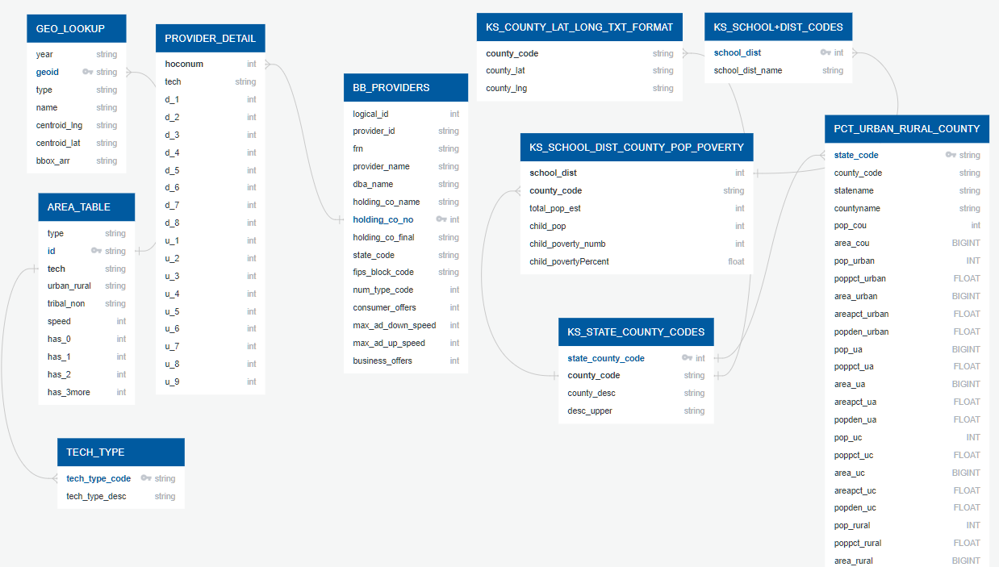

# Rural Surge: A Study of Internet Quality & Availability in Kansas

### Project Team
Sebastian Scholl, Fernando Porras, Mindy Collmeyer, Teresa Wehmeier

### Background on our Topic
For small rural counties in Kansas, the 2020 pandemic emphasized a lack of quality internet access. Schools were closed, and emergency remote instruction became the method to address educational delivery moving into fall 2020. However, as students and parents attempted to learn and work from home, it became clear that not all internet is created equal. Many community members had only cellular data service, which made participating in an online learning environment impossible. Those who had internet access experienced low download rates that many were unable to participate in online class activities.

Our group decided to dive into this topic, and research internet availability and quality in the state of Kansas.

### Communication Protocols
- Group Slack channel
- Group Project GitHub, including a branch for each team member
- Breakout room during class time
- Saturday Zoom calls (March 19th and 26th)
- Team has shared phone numbers and email addresses

### Tools Used on our Project
- [GitHub](https://github.com/)
    * The largest and most advanced development platform in the world.
    * Used to organize our research and documentation.
- [Pandas](https://pandas.pydata.org/)
    * A fast, powerful, flexible and easy to use open source data analysis and manipulation tool, built on top of the Python programming language
- [Python](https://www.python.org/)
    * A general-purpose, versatile, and powerful programming language.
- [QuickDBD](https://www.quickdatabasediagrams.com/)
    * A simple online tool to quickly draw database diagrams.
    * Used to create ERDs.
- [Visual Studio Code](https://code.visualstudio.com/)
   * A code editor redefined and optimized for building and debugging modern web and cloud applications
- [Canva](https://www.canva.com/)
    * Online design and publishing tool.
    * Used to design the Project Flowchart.
- [GeoJSON](https://geojson.org/)
    * A format for encoding a variety of geographic data structures.
- [Google Slides](https://docs.google.com/presentation/d/1s3hrkMdUn2UQK7V6L73jDXKZyd1Sj-ZztJQ3GYvPlYY/edit#slide=id.g1205a2ea841_0_1)
    * Used to present our project plan.
- [Tableau](https://www.tableau.com/)
    * A visual analytics platform transforming the way we use data to solve problems—empowering people and organizations to make the most of their data.

### Project Outline

**I. Our Topic**
     A. Internet Availability & Quality in Kansas
        1. How does internet access support (quality, availability, etc.) compare between rural and urban areas in Kansas?
        2.	What Internet Service Providers (ISPs) are available in Kansas? 
            a. How does their support vary between rural and urban communities?
        3. Is there a link between poverty rate and quality internet access?
        4. Is there a link between school district success and quality internet access?

**II. Our Project Plan**
      A. <Insert Project Plan diagram>
   
**III. Our Research**
      A. Where is our data coming from?
         1. [State Library of Kansas](https://kslib.info/423/State-Data-Center)
            a. Kansas info
               1.	County data
               2. Lat/long
               3. County population
               4. Poverty by county
               5.	School district info
         2. [FCC Fixed Broadband Deployment](https://broadbandmap.fcc.gov/#/data-download)
            a.	Internet Providers and speeds correlated with location
         3. [US Census Bureau](https://www.census.gov/programs-surveys/geography/guidance/geo-areas/urban-rural/2010-urban-rural.html)
            a. Population density

**IV.	Preparing the data**
      A.	Store csv files on GitHub
      B.	[Schema](https://github.com/Sebjet24/Rural_Surge/blob/Mindy/Resources/schema.sql)
      C. ERD - FCC data
         
      D.	ERD - State of Kansas data
         
      E.	Load data into a database using pgAdmin

**V.	Data Modeling**
   A.	Which machine learning model will work best for our project?
      1. Decision Tree
      <Flowchart>

**VI.	Visualize the Data**
      A.	Tableau
         1.	Images from Seward county fiber install
         2.	Maps
